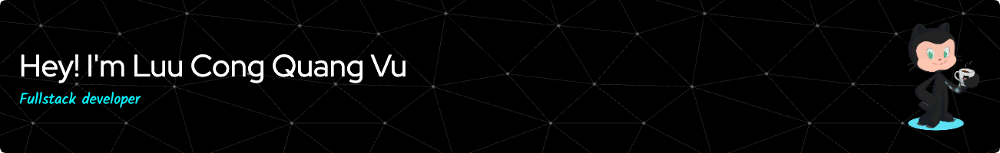

###
  <table border="0">
    <tr>
      <td>
        

          <h3>👩‍💻  About Me</h3>
          

            - 🔭 I’m working as a FullStack Developer 
            - 📚 I'm currently studying Machine Learning 
            - ⚡ In my free time I play sport or read book, study new technology,...
          

          

            
            
            
          

        

      </td>
      <td>
        

          
        

      </td>
    </tr>
  </table>

###
<h3 align="left">🛠 Language and tools</h3>

  
  
  
  
  
  
  
  
  
  
  
  
  
  
  
  
  
  
  
  
  
  
  
  
  
  
  
  
  
  
  
  
  
  
  
  
  
  
  
  

###

<h3 align="left">🔥   My Stats :</h3>

###

  

###

###

  

