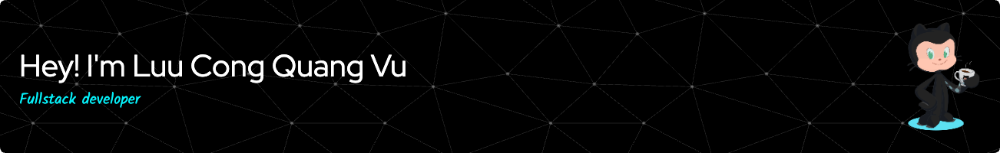

  

  <b>🌐 Language / Ngôn ngữ:</b>
  &nbsp;<a href="./README.md">🇬🇧 English</a>
  &nbsp;|&nbsp;
  <a href="./README.vi.md">🇻🇳 Tiếng Việt</a>

  
  
  
  

---

<table border="0">
  <tr>
    <td width="62%" valign="top">
      <h2>👋 &nbsp;Hey, I'm Vũ</h2>
      <blockquote>
        <em>"First, solve the problem. Then, write the code."</em>
      </blockquote>
      

        A <b>Full-Stack Engineer</b> from Vietnam, crafting products across web, mobile,
        and the emerging world of AI agents. I enjoy turning fuzzy ideas into shipped
        software — and reading the codebase closely enough that the next change feels obvious.
      

      

        Lately I spend most of my energy on <b>LLM-powered tooling</b>:
        MCP servers, agent harnesses, and dev-experience automation.
      

    </td>
    <td width="38%" align="center" valign="middle">
      
    </td>
  </tr>
</table>

---

## 🎯 &nbsp;What I'm Focused On

<table>
  <tr>
    <td width="33%" valign="top" align="center">
      <h3>🤖 &nbsp;AI & Agent Tooling</h3>
      
MCP servers, knowledge bases, and Claude Code workflows that make engineering teams faster.

    </td>
    <td width="33%" valign="top" align="center">
      <h3>🌐 &nbsp;Full-Stack Product</h3>
      
Vue / React frontends on top of Node, Elixir, and Python services — from prototype to production.

    </td>
    <td width="33%" valign="top" align="center">
      <h3>📚 &nbsp;Always Learning</h3>
      
Currently going deeper on Machine Learning, Rust, and the design tradeoffs behind large-scale systems.

    </td>
  </tr>
</table>

---

## 📈 &nbsp;GitHub at a Glance

  
  

  
  

---

## 🧠 &nbsp;Tech Stack

<table>
  <tr>
    <td align="center" width="140"><b>Languages</b></td>
    <td>
      
      
      
      
      
      
      
    </td>
  </tr>
  <tr>
    <td align="center"><b>Frameworks</b></td>
    <td>
      
      
      
      
      
      
      
    </td>
  </tr>
  <tr>
    <td align="center"><b>Data</b></td>
    <td>
      
      
      
      
      
    </td>
  </tr>
  <tr>
    <td align="center"><b>Platform</b></td>
    <td>
      
      
      
      
      
      
    </td>
  </tr>
</table>

---

## 🐍 &nbsp;Contribution Graph

  

---

  Thanks for stopping by. If something here sparks a collaboration, <a href="mailto:vuluu040320@gmail.com">let's talk</a>. ⭐️

